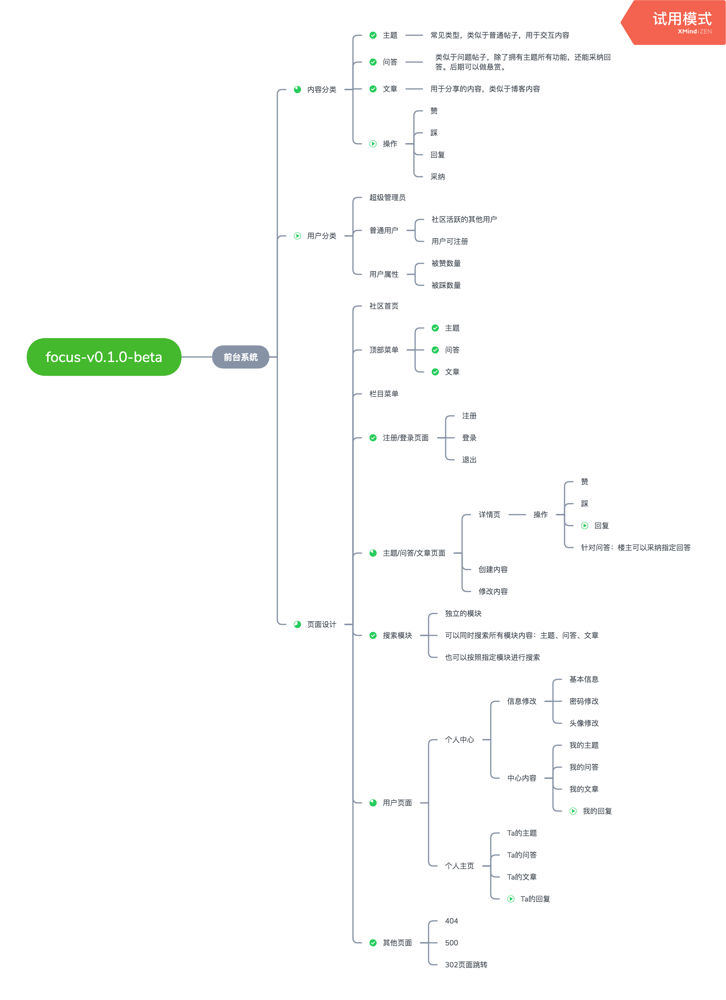

# `focus`聚焦社区

## 项目介绍

`focus`是`GoFrame`社区项目，采用了简洁强大的`GoFrame`作为后端`WEB`框架，
模板引擎用的是`GF`自带`template`模板，数据库用`MySQL`，前端使用`jQuery`/`bootstrap`框架。

项目文档：[focus聚焦社区文档](https://itician.org/pages/viewpage.action?pageId=3672317)

## 演示地址

请不要恶意发送垃圾数据哦~ 地址： [https://focus.goframe.org/](https://focus.goframe.org/) 

## 源码部署和配置

### 源码地址

* github：https://github.com/gogf/focus
* gitee：https://gitee.com/johng/focus

### 启动说明

1. 下载项目源码： `git clone https://github.com/gogf/focus` 
2. 创建`focus`数据库:
    ```sql
    CREATE DATABASE `focus` CHARACTER SET 'utf8mb4' COLLATE 'utf8mb4_bin';
    ```
3. 运行`document`下`focus.sql`初始化数据库`SQL`。
4. 复制`config`下`config.example.toml`为`config.toml`配置文件:
    ```toml
    # 数据库配置
    [database]
        link  = "mysql:root:123456@tcp(127.0.0.1:3306)/focus"
        debug = true
    ```
    其他配置根据需要自行调整。
5. 运行：`go run main.go`
6. 访问 http://127.0.0.1:8199 即可看到登录页面，默认账号/密码：`goframe` / `123456`

## 打包部署

1. 安装`gf-cli`，详情查看：https://itician.org/pages/viewpage.action?pageId=1114260
2. 打包命令：执行 `gf build` 即可。
3. 打包结果：默认 `linux/macos/windows` 三个版本。
    ```shell
    bin
    ├── darwin_amd64
    │   └── focus
    ├── linux_amd64
    │   └── focus
    └── windows_amd64
        └── focus.exe
    ```
4. 将`config,template,public`目录和`focus`放到同一级目录，启动`focus`即可。
> 也可将资源文件一同打包到可执行文件中一同发布/部署，具体请参考：https://itician.org/pages/viewpage.action?pageId=1115788

## 项目结构

```
├── app
│ ├── dao
│ ├── model
│ ├── shared
│ └── system
│     ├── admin
│     │ └── internal
│     └── index
│         └── internal
│             ├── api
│             ├── define
│             └── service
├── config
├── document
├── library
├── packed
├── public
├── template
├── upload
├── Dockerfile
├── go.mod
└── main.go
```

### 目录说明

|目录/文件名称   | 说明 | 描述
|---|---|---
|`app`           | 业务逻辑层 | 所有的业务逻辑存放目录。
| - `dao`        | 数据访问   | 数据库的访问操作，仅包含最基础的数据库CURD方法。
| - `model`      | 数据模型   | 存放数据相关的实体结构定义。
| - `system`     | 系统模块   | 内部可能包含多个子系统，不同子系统之间资源相互隔离。
| &nbsp; &nbsp; - `index`    | 前端页面 | 子系统，前端页面。
| &nbsp; &nbsp; &nbsp; &nbsp; - `internal`       | 内部模块 | 系统内部模块，仅供当前内部系统调用，无法在系统间共享。
| &nbsp; &nbsp; &nbsp; &nbsp; &nbsp; - `api`     | 业务接口 | 系统内部接收/解析用户输入参数的入口/接口层
| &nbsp; &nbsp; &nbsp; &nbsp; &nbsp; - `define`  | 结构定义 | 系统内部的输入、输出数据结构定义。
| &nbsp; &nbsp; &nbsp; &nbsp; &nbsp; - `service` | 逻辑封装 | 系统内部业务逻辑封装，实现特定的业务需求。
|`config`        | 配置管理   | 所有的配置文件存放目录。
|`docker`        | 镜像文件   | Docker镜像相关依赖文件，脚本文件等等。
|`document`      | 项目文档   | Documentation项目文档，如: 设计文档、帮助文档等等。
|`library`       | 公共库包   | 公共的功能封装包，往往不包含业务需求实现。
|`packed`        | 打包目录   | 将资源文件打包的`Go`文件存放在这里，`boot`包初始化时会自动调用。
|`public`        | 静态目录   | 仅有该目录下的文件才能对外提供静态服务访问。
|`template`      | 模板文件   | MVC模板文件存放的目录。
|`Dockerfile`    | 镜像描述 | 云原生时代用于编译生成Docker镜像的描述文件。
|`go.mod`        | 依赖管理   | 使用`Go Module`包管理的依赖描述文件。
|`main.go`       | 入口文件   | 程序入口文件。

## 数据库表结构


## 模块进度

