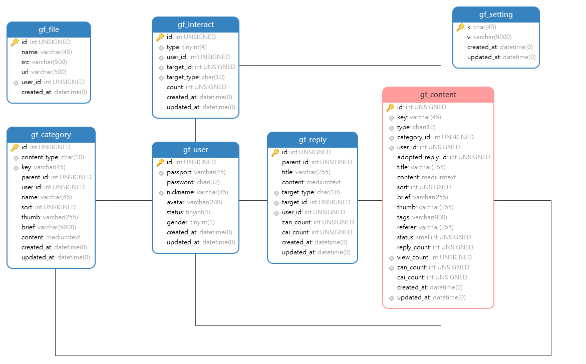

# `Focus`聚焦社区


`Focus聚焦社区`是`GoFrame`社区项目，采用了简洁强大的`GoFrame`作为后端`WEB`框架， 由于前台系统需要`SEO`因此使用了`GF`自带`template`模板引擎，数据库用`MySQL`，前端使用`jQuery`/`bootstrap`框架。

一、源码地址
======

*   `github`：[https://github.com/gogf/focus](https://github.com/gogf/focus)
*   `gitee`：[https://gitee.com/johng/focus](https://gitee.com/johng/focus)

二、演示地址
======

请不要恶意发送垃圾数据哦~ 地址：[https://focus.goframe.org/](https://focus.goframe.org/)

三、安装部署
======

安装
--

1、下载项目源码： `git clone [https://github.com/gogf/focus](https://github.com/gogf/focus)`

2、创建`focus`数据库:
```sql
CREATE DATABASE `focus` CHARACTER SET 'utf8mb4' COLLATE 'utf8mb4_bin';
```
3、运行`document`下`focus.sql`初始化数据库`SQL`。

4、复制`config`下`config.example.toml`为`config.toml`配置文件，其他配置根据需要自行调整。

```toml
# 数据库连接配置
    [database.default]
        link   = "mysql:root:12345678@tcp(127.0.0.1:3306)/focus"
        debug  = true
```
5、运行：`go run main.go`

6、访问 [http://127.0.0.1:8199](http://127.0.0.1:8199/) 即可看到登录页面，默认账号/密码：`goframe` / `123456`

linux一键部署
--

一键部署仅支持linux，并且需要先完成docker-compose安装;

```bash
git clone https://github.com/gogf/focus && \
 cd focus && chmod 755 focus.sh && ./focus.sh build
```

更多命令，请执行`./focus help`

部署
--

1、安装`gf-cli`工具链，详情查看：[开发工具](https://itician.org/pages/viewpage.action?pageId=1114260)

2、打包命令：执行 `gf build` 即可，具体配置请参考：[build 交叉编译](https://itician.org/pages/viewpage.action?pageId=1115788)

3、打包结果：默认 `linux/macos/windows` 三个版本。
```html
bin
├── darwin_amd64
│   └── focus
├── linux_amd64
│   └── focus
└── windows_amd64
    └── focus.exe
```
4、将`config.toml`和`focus`放到同一级目录，启动`focus`即可。

发布
--

默认配置文件配置中，会将`public,template`目录进行二进制打包，随着可执行文件一同发布。因此，发布时仅需要将`config.toml`和`focus`拷贝到目标服务器运行即可。此外，您也可以考虑将特定的配置文件用打包发布，那么发布时仅需要发布`focus`可执行文件即可。

如果您想同时打包配置文件到可执行文件中，那么您可以同时参考一下关于默认配置文件读取的修改方式：[配置管理里#默认文件修改](https://itician.org/pages/viewpage.action?pageId=1114668#id-%E9%85%8D%E7%BD%AE%E7%AE%A1%E7%90%86-%E9%BB%98%E8%AE%A4%E6%96%87%E4%BB%B6%E4%BF%AE%E6%94%B9)

四、项目结构
======
```
├── app
│ ├── dao
│ ├── model
│ ├── shared
│ └── system
│     ├── admin
│     │ └── internal
│     └── index
│         └── internal
│             ├── api
│             ├── define
│             └── service
├── config
├── document
├── library
├── packed
├── public
├── template
├── upload
├── Dockerfile
├── go.mod
└── main.go
```
五、目录说明
======

|目录/文件名称   | 说明 | 描述
|---|---|---
|`app`           | 业务逻辑层 | 所有的业务逻辑存放目录。
| - `dao`        | 数据访问   | 数据库的访问操作，仅包含最基础的数据库CURD方法。
| - `model`      | 数据模型   | 存放数据相关的实体结构定义。
| - `system`     | 系统模块   | 内部可能包含多个子系统，不同子系统之间资源相互隔离。
| &nbsp; &nbsp; - `index`    | 前端页面 | 子系统，前端页面。
| &nbsp; &nbsp; &nbsp; &nbsp; - `internal`       | 内部模块 | 系统内部模块，仅供当前内部系统调用，无法在系统间共享。
| &nbsp; &nbsp; &nbsp; &nbsp; &nbsp; - `api`     | 业务接口 | 系统内部接收/解析用户输入参数的入口/接口层
| &nbsp; &nbsp; &nbsp; &nbsp; &nbsp; - `define`  | 结构定义 | 系统内部的输入、输出数据结构定义。
| &nbsp; &nbsp; &nbsp; &nbsp; &nbsp; - `service` | 逻辑封装 | 系统内部业务逻辑封装，实现特定的业务需求。
|`config`        | 配置管理   | 所有的配置文件存放目录。
|`docker`        | 镜像文件   | Docker镜像相关依赖文件，脚本文件等等。
|`document`      | 项目文档   | Documentation项目文档，如: 设计文档、帮助文档等等。
|`library`       | 公共库包   | 公共的功能封装包，往往不包含业务需求实现。
|`packed`        | 打包目录   | 将资源文件打包的`Go`文件存放在这里，`boot`包初始化时会自动调用。
|`public`        | 静态目录   | 仅有该目录下的文件才能对外提供静态服务访问。
|`template`      | 模板文件   | MVC模板文件存放的目录。
|`Dockerfile`    | 镜像描述 | 云原生时代用于编译生成Docker镜像的描述文件。
|`go.mod`        | 依赖管理   | 使用`Go Module`包管理的依赖描述文件。
|`main.go`       | 入口文件   | 程序入口文件。

六、框架设计
======

由于采用了强大易用的`GoFrame`开发框架，可以参考框架的一些设计介绍。

*   [代码分层设计](https://itician.org/pages/viewpage.action?pageId=3672442)
*   [对象封装设计](https://itician.org/pages/viewpage.action?pageId=3672526)
*   [Context上下文](https://itician.org/pages/viewpage.action?pageId=3672552)
*   [单应用多系统设计](https://itician.org/pages/viewpage.action?pageId=3672600)
*   更多：[框架设计](https://itician.org/pages/viewpage.action?pageId=3672399)

七、项目截图
======


图1. 社区首页


图2. 登录页面


图3. 注册页面


图4. 发布/编辑页面


图5. 内容详情


图6. 搜索页面


图7. 个人主页


图8. 编辑资料

八、数据库表设计
========



九、功能模块进度
========


十、Focus文档
========

更多资料请移步：[Focus聚焦社区文档](https://goframe.org/pages/viewpage.action?pageId=3672270)